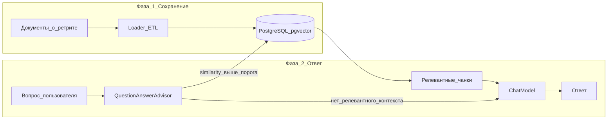
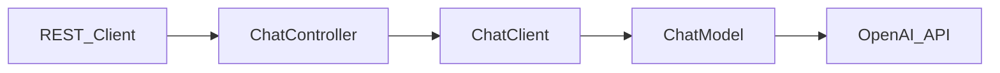
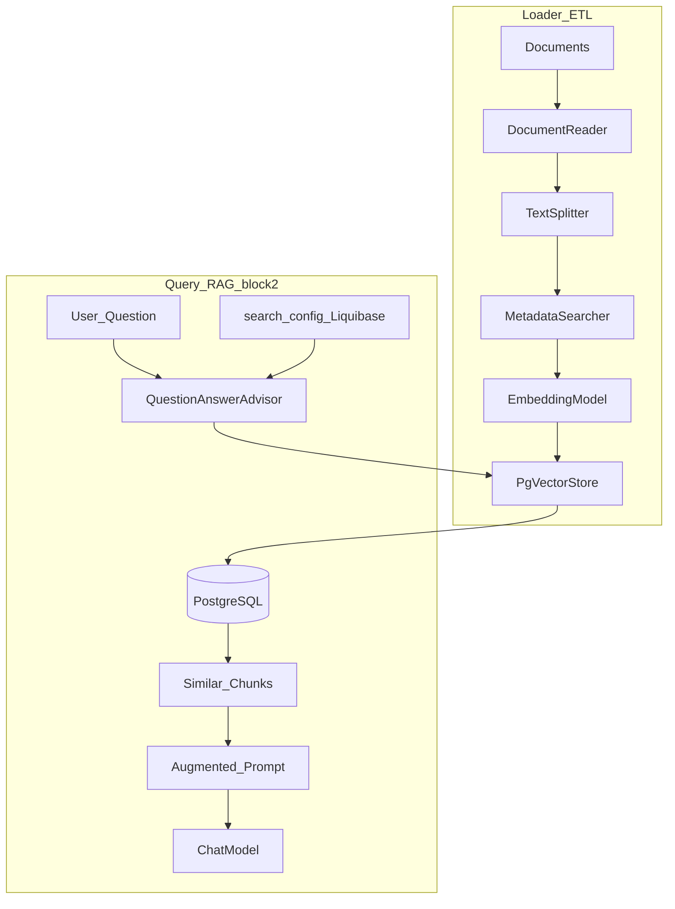
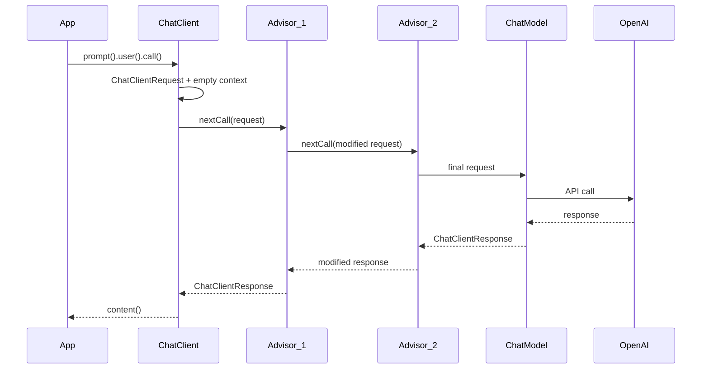
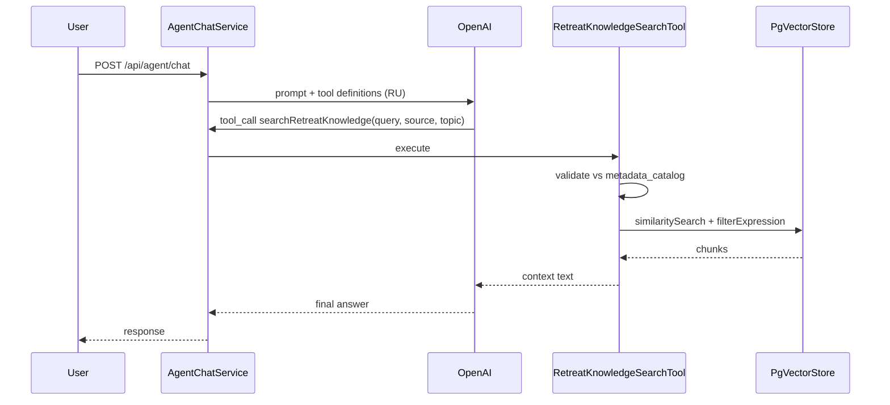
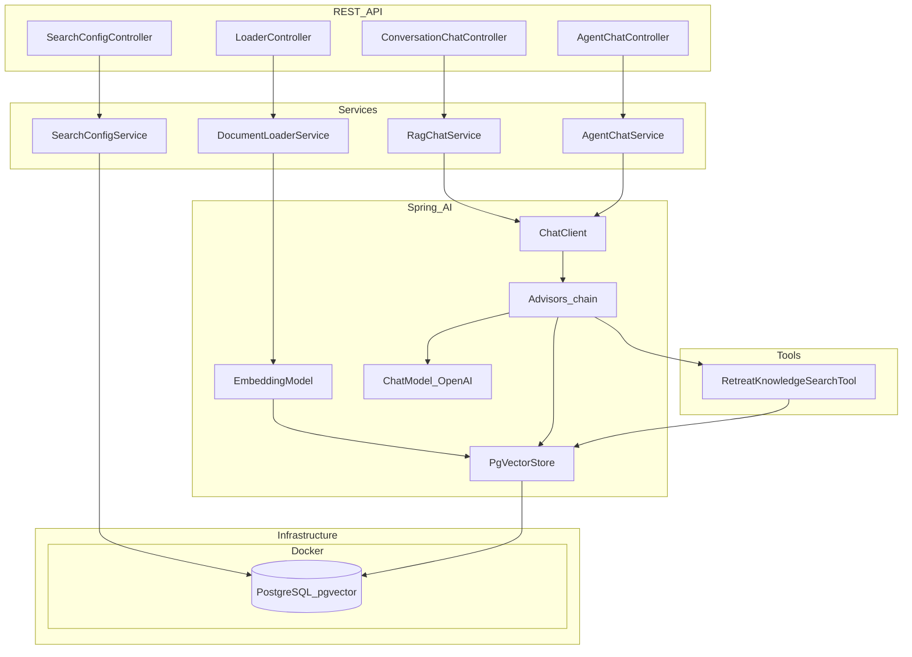

# План доклада Spring AI и демо-проекта

## Контекст

- Репозиторий `spring_ai_retrit` — демо-проект для доклада по Spring AI.
- Стек: **Java 25**, **Spring Boot 3.5+**, **Spring AI 1.1.x**, **OpenAI**, **PostgreSQL + pgvector** (в Docker), **Liquibase** (схема + seed каталога metadata + настройки поиска).
- **Инфраструктура БД**: PostgreSQL **только в контейнере** (`docker compose`); локальная установка Postgres не требуется. Spring Boot подключается к `localhost:5432` (проброс порта из контейнера).
- Формат: **~60 мин** — полный разбор всех тем + live demo.
- **Взаимодействие с приложением**: только **HTTP-запросы** (REST API). Никакого UI, psql, CommandLineRunner на сцене. Доступ к БД на докладе — только через приложение (не заходим в контейнер).
- **Системонезависимые запросы**: все примеры в [README.MD](README.MD) в формате HTTP Client (IntelliJ IDEA, VS Code REST Client, Postman import) — один и тот же набор на Linux/macOS/Windows.
- Сквозной сценарий: **«Ассистент ретрита»** — сначала сохраняем информацию о ретрите, затем при вопросах на эту тему подтягиваем релевантные фрагменты и отвечаем на их основе.

---

## Инфраструктура: PostgreSQL в Docker

PostgreSQL с расширением **pgvector** поднимается **исключительно в контейнере** — единый способ для Linux/macOS/Windows на докладе.

**`docker-compose.yml`:**

```yaml
services:
  postgres:
    image: pgvector/pgvector:pg16
    container_name: retreat-postgres
    ports:
      - "5432:5432"
    environment:
      POSTGRES_USER: postgres
      POSTGRES_PASSWORD: postgres
      POSTGRES_DB: postgres
    volumes:
      - retreat-pgdata:/var/lib/postgresql/data
    healthcheck:
      test: ["CMD-SHELL", "pg_isready -U postgres"]
      interval: 5s
      timeout: 5s
      retries: 5

volumes:
  retreat-pgdata:
```

| Параметр | Значение |
|----------|----------|
| Образ | `pgvector/pgvector:pg16` |
| Порт на хосте | `5432` → контейнер `5432` |
| БД / пользователь / пароль | `postgres` / `postgres` / `postgres` |
| Данные | volume `retreat-pgdata` (переживает `docker compose down`) |

**Запуск перед докладом:**

```bash
docker compose up -d          # поднять Postgres в контейнере
docker compose ps             # убедиться, что healthcheck OK
mvn spring-boot:run           # приложение на хосте → jdbc:localhost:5432
```

**На сцене:** показываем только `docker compose up -d` в подготовке; во время demo — HTTP-запросы, без shell в контейнере.

**Что хранится в контейнере:**

- `vector_store` — Spring AI PgVectorStore (`initialize-schema: true`)
- `metadata_catalog` — Liquibase при старте приложения
- `spring_ai_chat_memory` — история сообщений (`JdbcChatMemoryRepository`), ключ `conversation_id` = **идентификатор пользователя**

---

## Концепт приложения

**Идея в одном предложении:** загружаем знания о ретрите в базу → пользователь задаёт вопрос → если он связан с ретритом, находим похожие фрагменты в pgvector и отвечаем с опорой на них; если нет — отвечаем без «выдуманного» контекста ретрита.



### Что храним (источники знаний о ретрите)

Документы в `src/main/resources/documents/retreat/` — каждый файл задаёт metadata `source`; внутри — YAML-frontmatter для `topic`:

```markdown
---
topic: yoga
---
# Расписание йоги
...
```

| Файл | `source` | `topic` (примеры) |
|------|----------|-------------------|
| `schedule.md` | `schedule` | `yoga`, `meditation`, `workshop` |
| `location.md` | `location` | `logistics` |
| `speakers.md` | `speakers` | `yoga`, `meditation` |
| `faq.md` | `faq` | `registration`, `rules` |

Загрузка в БД выполняется **на сцене в блоках 2–3** через `POST /api/admin/load` — до этого `vector_store` пуста, приложение стартует без предзагрузки данных.

### Как определяем «вопрос про ретрит»

1. **Similarity search** — `QuestionAnswerAdvisor` / `SearchRequest` с `similarityThreshold` из Liquibase (по умолчанию ~0.78): если похожих чанков нет, контекст ретрита в prompt не попадает.
2. **System prompt** — явная инструкция модели:
   - *«Отвечай на основе CONTEXT только если он предоставлен и релевантен вопросу о ретрите. Если контекста нет — честно скажи, что в базе знаний ретрита нет информации по этому вопросу.»*
3. **Live-контраст на сцене** (только HTTP, см. [README.MD — Блок 2](README.MD#блок-2-rag--loader-и-базовый-поиск)):
   - ✅ «Во сколько завтра йога?» → ответ из `schedule.md`
   - ✅ «Кто ведёт медитацию?» → ответ из `speakers.md`
   - ❌ «Что такое Spring Boot?» → ответ без галлюцинаций про ретрит

### Роль остальных блоков в этом концепте

| Механизм | Зачем в сценарии ретрита |
|----------|-------------------------|
| **RAG + pgvector** | Ядро: хранение и поиск знаний; metadata задаётся при load |
| **Metadata + Tool** | Блок 4: каталог в **реляционной таблице** (Liquibase) → ИИ выбирает → tool валидирует по БД |
| **Memory** | История диалога в **PostgreSQL** (`JdbcChatMemoryRepository`), ключ — **идентификатор пользователя** |
| **Tools** | Блок 4: `RetreatKnowledgeSearchTool` (String + каталог БД) |
| **Advisors** | Точки расширения pipeline (логирование, timing) |
| **Настройки поиска** | `application.yml` + PUT в памяти | `similarity_threshold`, `top_k` — демо freud на сцене |

---

## Хронометраж доклада (60 мин)

| Блок                      | Время  | Содержание                                                                                |
| ---------------------------| --------| -------------------------------------------------------------------------------------------|
| 1. Введение               | 5 мин  | Зачем Spring AI, portable API, ChatClient как точка входа                                 |
| 2. RAG                    | 12 мин | Liquibase (каталог) → **Loader чанков** → PgVectorStore → RAG             |
| 2b. Точность поиска       | 5 мин  | Настройка threshold/topK; кейс **freud** при низком пороге                                |
| 3. Жизненный цикл запроса | 8 мин  | Advisor chain; **запросы к уже загруженным данным** + логи pipeline                       |
| 4. Tools                  | 12 мин | Function calling; поиск по metadata через tool |
| 5. История сообщений      | 8 мин  | ChatMemory в PostgreSQL, `MessageChatMemoryAdvisor`, идентификация по **user id**         |
| 6. Практические советы    | 5 мин  | Промпты, structured output, порядок advisors, кейсы качества поиска                       |
| 7. Production-ready       | 5 мин  | Советы (тезисы) для prod                                                                  |
| 8. Q&A                    | 5 мин  | Резерв                                                                                    |

---

## Блок 1. Введение — «Зачем Spring AI»

### Тезисы

1. Spring AI — **portable abstraction** над LLM-провайдерами (смена модели = смена starter/properties).
2. Три столпа: **ChatModel** (генерация), **EmbeddingModel** (векторизация), **VectorStore** (хранение).
3. **ChatClient** — fluent API, аналог `RestClient`/`WebClient` для LLM.
4. **Advisors** — Spring-way для cross-cutting concerns (RAG, memory, tools, logging).

### Что показать в проекте

- `pom.xml` — BOM, OpenAI, pgvector, **liquibase-core**, JPA/JDBC.
- `docker-compose.yml` — **PostgreSQL + pgvector в контейнере** (`pgvector/pgvector:pg16`, порт `5432`, volume для данных).
- `application.yml` — `spring.ai.openai.api-key` через env, `spring.datasource.url=jdbc:postgresql://localhost:5432/postgres` (хост → проброс из контейнера), `spring.ai.vectorstore.pgvector.initialize-schema=true`.
- Проверочный запрос: `POST /api/chat` без RAG-advisor → «привет, кто ты?» ([README.MD — Блок 1](README.MD#блок-1-введение--проверка-без-rag)).
- **Без автозагрузки данных** при старте — БД наполняется только в блоке 2.



---

## Блок 2. RAG — «Как построить систему»

### Тезисы

1. **Проблема**: LLM не знает про *ваш* ретрит → RAG = сохранить знания → при релевантном вопросе Retrieve + Augment + Generate.
2. **Два этапа жизненного цикла**:
   - **Write path** (Loader): документы о ретрите → чанки → embeddings → pgvector.
   - **Read path** (query): вопрос → similarity search → если есть совпадения, augment prompt → generate.
3. **ETL-пайплайн** (как в [Spring AI Concepts](https://docs.spring.io/spring-ai/reference/concepts.html)):
   - **Extract**: `DocumentReader` (PDF, Markdown, Tika).
   - **Transform**: `TextSplitter` (`TokenTextSplitter`) — чанки по смыслу и лимиту токенов.
   - **Load**: `EmbeddingModel.embed()` → `PgVectorStore.add()`.
4. **Релевантность вопроса** — `similarityThreshold` в `QuestionAnswerAdvisor` / `SearchRequest`: нерелевантный вопрос не получает контекст ретрита (защита от галлюцинаций). Значение читается из `search_config` (Liquibase seed + runtime `PUT`).
5. **Два уровня RAG в Spring AI**:
   - **Простой**: `QuestionAnswerAdvisor` — retrieve + inject в prompt.
   - **Продвинутый** (`spring-ai-rag`): `RetrievalAugmentationAdvisor` — composable pipeline (query transformers, retrievers, post-processors).
6. **Ключевые классы**:

| Класс / интерфейс | Роль |
|---|---|
| `Document`, `DocumentReader` | Исходные данные |
| `TextSplitter` | Разбиение на чанки |
| `EmbeddingModel` | Текст → вектор |
| `VectorStore` / `PgVectorStore` | Хранение и similarity search в PostgreSQL |
| `SearchRequest` | topK, threshold, **filterExpression** |
| `Document.getMetadata()` | Метаданные чанка (source, topic, …) |
| `FilterExpressionBuilder` | Программная сборка фильтров |
| `QuestionAnswerAdvisor.FILTER_EXPRESSION` | Runtime-фильтр (в `RetreatKnowledgeSearchTool`) |
| `QuestionAnswerAdvisor` | RAG «из коробки» |
| `RetrievalAugmentationAdvisor` | Модульный RAG |
| `VectorStoreDocumentRetriever` | Кастомный retriever |
| `RewriteQueryTransformer` | Переформулировка запроса |

7. **Практический совет**: загрузка данных — **по HTTP** (`POST /api/admin/load`) в блоке 2 на сцене; не `@PostConstruct`, не CommandLineRunner.
8. **PostgreSQL + pgvector в Docker** — production-ready VectorStore: персистентность в volume контейнера, HNSW-индекс; `dimensions` = 1536 (OpenAI `text-embedding-3-small`). Приложение на хосте, БД — в контейнере.
9. **Метаданные векторов** — при load каждый чанк получает metadata (`source`, `topic`, `retreatYear`); в блоке 2 показываем **сохранение**, фильтрацию по metadata — в **блоке 4 через tool** (ИИ решает, нужен ли фильтр и какой).

#### Схема metadata для ретрита

**Три слоя данных в PostgreSQL (контейнер):**

| Слой | Где хранится | Назначение |
|------|--------------|------------|
| **Каталог поиска** | `metadata_catalog` | допустимые пары ключ/значение; seed через **Liquibase** |
| **Настройки поиска** | `search_config` | `similarity_threshold`, `top_k` — управление точностью RAG на сцене |
| **Данные чанков** | `vector_store.metadata` (json) | фактические `source`, `topic`, `retreatYear` на каждом чанке |

Значения при load (`MetadataSearcher`) **валидируются** по каталогу из БД — нельзя записать `topic=unknown`, если его нет в `metadata_field_value`.

| Ключ чанка | Тип | Примеры | Откуда |
|------------|-----|---------|--------|
| `source` | string | `schedule`, `speakers`, `location`, `faq` | имя файла + каталог |
| `topic` | string | `yoga`, `meditation`, `logistics`, … | frontmatter + каталог |
| `retreatYear` | number | `2026` | константа / frontmatter |

#### Liquibase — полная схема демо

Liquibase накатывается **при старте приложения** и подготавливает всё, что нужно до live load на сцене: каталог metadata, настройки точности поиска, начальные значения порога.

```
src/main/resources/db/changelog/
  ├── db.changelog-master.yaml
  └── changes/
      ├── 001-create-metadata-catalog.yaml       # DDL каталога metadata
      ├── 002-seed-metadata-catalog.yaml         # INSERT полей и значений
      ├── 003-create-search-config.yaml          # DDL настроек поиска
      └── 004-seed-search-config.yaml            # INSERT порога и topK по умолчанию
```

**001 — каталог searchable metadata** (`metadata_field`, `metadata_field_value`):

```sql
CREATE TABLE metadata_field (
    id          BIGSERIAL PRIMARY KEY,
    field_name  VARCHAR(64)  NOT NULL UNIQUE,
    description TEXT,
    searchable  BOOLEAN      NOT NULL DEFAULT TRUE
);

CREATE TABLE metadata_field_value (
    id          BIGSERIAL PRIMARY KEY,
    field_id    BIGINT       NOT NULL REFERENCES metadata_field(id),
    value       VARCHAR(128) NOT NULL,
    description TEXT,
    UNIQUE (field_id, value)
);
```

**002 — seed каталога:**

| field_name | values |
|------------|--------|
| `source` | `schedule`, `speakers`, `location`, `faq` |
| `topic` | `yoga`, `meditation`, `workshop`, `logistics`, `registration`, `rules` |

**003 — настройки точности поиска** (`search_config`):

```sql
CREATE TABLE search_config (
    id                    BIGSERIAL PRIMARY KEY,
    config_key            VARCHAR(64)  NOT NULL UNIQUE,
    similarity_threshold  DOUBLE PRECISION NOT NULL,
    top_k                 INTEGER      NOT NULL,
    description           TEXT,
    updated_at            TIMESTAMPTZ  NOT NULL DEFAULT NOW()
);
```

**004 — seed search_config** (строгий режим по умолчанию):

| config_key | similarity_threshold | top_k | description |
|------------|---------------------|-------|-------------|
| `default` | `0.78` | `4` | Строгий порог: off-topic не получает контекст |

**Зачем search_config в Liquibase, а не только в `application.yml`:**

- На сцене меняем точность **без перезапуска** — `PUT /api/admin/search-config`.
- Аудитория видит связь: схема БД (Liquibase) → runtime-поведение Spring AI (`SearchRequest`).
- `SearchConfigService` читает актуальные значения и передаёт в `QuestionAnswerAdvisor` / `RagChatService`.

**Зависимости:** `org.liquibase:liquibase-core` + `JdbcTemplate` / JPA для `SearchableMetadataService` и `SearchConfigService`.

При load (`DocumentLoaderService`):

```java
Document chunk = new Document(text);
chunk.getMetadata().put("source", "schedule");
chunk.getMetadata().put("topic", "yoga");
chunk.getMetadata().put("retreatYear", 2026);
vectorStore.add(List.of(chunk));
```

**Фильтрация при query** — не вручную из HTTP, а через tool в блоке 4 (см. `RetreatKnowledgeSearchTool`).

### HTTP-запросы блока 2

Все запросы — в [README.MD](README.MD#блок-2-rag--loader-и-базовый-поиск).

| # | Запрос | Назначение |
|---|--------|-----------|
| 1 | `GET /api/metadata/searchable` | Каталог metadata из Liquibase |
| 2 | `GET /api/admin/search-config` | Текущий порог similarity и topK |
| 3 | `POST /api/admin/load` | **Загрузить** документы ретрита в pgvector (live на сцене) |
| 4 | `POST /api/chat` — «во сколько йога?» | RAG без фильтра (QuestionAnswerAdvisor) |
| 5 | `POST /api/chat` — «что такое SOLID?» | Контраст: нет контекста ретрита (высокий порог) |

### Что показать в проекте

```
docker-compose.yml
src/main/resources/documents/retreat/
src/main/resources/db/changelog/
src/main/java/.../config/
  ├── PgVectorStoreConfig.java
  └── RetreatConfig.java
src/main/java/.../rag/
  ├── loader/
  │   ├── DocumentLoaderService.java
  │   ├── MetadataSearcher.java
  │   └── LoaderController.java
  ├── metadata/
  │   └── service/SearchConfigService.java
  └── RagChatService.java
```

**Live demo блока 2** — запросы из README.MD:
1. `GET /api/metadata/searchable` + `GET /api/admin/search-config` — Liquibase уже накатил схему
2. `POST /api/admin/load` + RAG-запрос



**Блок 4** — отдельный path: ИИ → `RetreatKnowledgeSearchTool` → `filterExpression` → pgvector (см. ниже).

**Конфигурация** (`application.yml`):

```yaml
spring:
  liquibase:
    change-log: classpath:db/changelog/db.changelog-master.yaml
  datasource:
    url: jdbc:postgresql://localhost:5432/postgres   # localhost = проброс порта из docker-compose
    username: postgres
    password: postgres
  ai:
    vectorstore:
      pgvector:
        initialize-schema: true   # vector_store — Spring AI; каталог + search_config — Liquibase
```

**Пример system prompt** (`RetreatConfig.SYSTEM_PROMPT`):

```
Ты — ассистент корпоративного ретрита.
Отвечай на вопросы об ретрите ТОЛЬКО на основе CONTEXT ниже.
Если CONTEXT пуст или не относится к вопросу — скажи, что в базе знаний ретрита нет ответа.
Не выдумывай расписание, спикеров и правила.
```

---

## Блок 2b. Точность поиска и кейс «freud»

### Тезисы

1. **Точность RAG** = баланс `similarityThreshold` + `topK` в `SearchRequest` / `QuestionAnswerAdvisor`.
2. **Высокий порог** (~0.75–0.85): в prompt попадают только близкие чанки → off-topic вопросы не «подтягивают» контекст ретрита.
3. **Низкий порог** (~0.30–0.45): слабо связанные чанки проходят фильтр → модель получает **нерелевантный CONTEXT** и начинает «додумывать» ответ про ретрит на вопросы вне домена.
4. **Кейс freud** (намеренное название демо): показать, что при заниженном пороге ассистент **галлюцинирует** связь off-topic вопроса с документами ретрита — как «подсознательная» подгонка фактов под контекст.
5. На сцене: `PUT` порог вниз → тот же «Что такое SOLID?» → ответ с выдуманными деталями ретрита → `PUT` порог обратно → честный отказ.

### HTTP-запросы блока 2b

[README.MD — Блок 2b](README.MD#блок-2b-настройка-точности-поиска-spring-ai--liquibase)

| Шаг | Действие | Ожидаемый эффект |
|-----|----------|------------------|
| 1 | `PUT` threshold `0.35`, topK `8` | Режим «freud» |
| 2 | `POST /api/chat` — «Что такое SOLID?» | Модель цепляется за слабые чанки → галлюцинация |
| 3 | `PUT` threshold `0.78`, topK `4` | Возврат к prod-режиму |
| 4 | Повторить off-topic вопрос | Честный отказ без контекста ретрита |

### Что показать в проекте

- `SearchConfigService` — чтение/обновление `search_config`, кэш с инвалидацией после `PUT`.
- `SearchConfigController` — `GET` / `PUT /api/admin/search-config`.
- `RagChatService` — строит `SearchRequest.builder().similarityThreshold(...).topK(...)` из БД.
- Логи: similarity score найденных чанков (для объяснения, почему freud сработал).

---

## Кейсы настройки качества поиска (Spring AI)

Планируем показать на докладе, как **настройками Spring AI** (без смены модели) улучшать или ухудшать качество retrieval. Все кейсы — HTTP из [README.MD — Блок 6/7](README.MD#блок-6--7-кейсы-улучшения-качества-поиска-spring-ai).

| Кейс | Параметр Spring AI | Демо-вопрос | Что показываем |
|------|-------------------|-------------|----------------|
| **A. Шумный контекст** | `topK` ↑ (12) | «Расскажи про все утренние активности» | Больше чанков в prompt → полнее ответ, но риск противоречий |
| **B. Потеря деталей** | `topK` ↓ (2) | тот же вопрос | Меньше контекста → ответ неполный |
| **C. Строгая релевантность** | `similarityThreshold` ↑ (0.80) | off-topic | Контекст не попадает → нет галлюцинаций |
| **D. Freud** | `similarityThreshold` ↓ (0.35) | off-topic | Слабые совпадения → выдуманный ответ про ретрит |
| **E. Metadata-фильтр** | `filterExpression` через tool | «Какие правила про телефоны?» | Agent + `source=faq` → точнее, чем голый vector search |
| **F. Query rewrite** | `RewriteQueryTransformer` (опционально) | «А во сколько она?» после memory | Переформулировка с учётом истории → лучший recall |

**Связь с Liquibase:** кейсы C, D, A, B меняют `search_config` через `PUT`; кейс E — каталог `metadata_field_value` + tool; кейс F — advisor chain (блок 5).

**Вывод для аудитории:** качество RAG — не только «загрузили PDF», а итерация порога, topK, metadata-фильтров и порядка advisors.

---

## Блок 3. Жизненный цикл запроса и точки воздействия

### Тезисы

1. Поток вызова `chatClient.prompt().advisors(...).user(text).call()`:



2. **Advisor chain** — ordered stack (`getOrder()`, меньше = раньше на request, позже на response).
3. **Точки вмешательства** (где писать свой код):

| Точка | Что делать | Пример |
|-------|-----------|--------|
| Request (до LLM) | Обогатить prompt, RAG, memory | `QuestionAnswerAdvisor`, `MessageChatMemoryAdvisor` |
| Block request | Short-circuit без LLM | Кастомный advisor с guardrails |
| Response (после LLM) | Фильтрация, логирование | `LoggingAdvisor` |
| Shared state | Передать данные между advisors | `advise-context` (Map) |
| Runtime params | Параметры на вызов | `.advisors(a -> a.param(...))` |

4. Интерфейсы для кастомных advisors: `CallAdvisor` / `StreamAdvisor`, методы `nextCall()` / `nextStream()`.

### HTTP-запросы блока 3

[README.MD — Блок 3](README.MD#блок-3-жизненный-цикл-запроса-advisors)

| # | Запрос | Назначение |
|---|--------|-----------|
| 1 | `POST /api/chat` — вопрос про ретрит | Показать augmented prompt в логах (LoggingAdvisor) |
| 2 | `POST /api/chat` — «Где завтрак?» | Показать augmented prompt в логах (`LoggingAdvisor`) |

### Что показать в проекте

- `LoggingAdvisor.java` — логирует prompt до/после, демонстрирует advisor chain.
- `AdvisorOrderConfig.java` — явный порядок: Memory → RAG → Logging → ToolCalling.
- **Live demo блока 3**: запросы из README.MD, параллельно показать лог advisor chain.

---

## Блок 4. Tools — поиск по metadata через tool

### Тезисы

1. Tools = **мост LLM ↔ ваши API/БД**; модель решает *когда*, *какой tool* и *с какими аргументами* вызвать.
2. **Паттерн «умный metadata-filter»**: каталог допустимых полей/значений → ИИ сопоставляет вопрос → при уверенности передаёт metadata в tool → tool строит `filterExpression` и ищет в pgvector.
3. **`SearchableMetadataService`** — читает каталог из `metadata_field` / `metadata_field_value`; используется в tool, Loader и `GET /api/metadata/searchable`.
4. **`RetreatKnowledgeSearchTool`** — `@Tool` с опциональными `@ToolParam source`, `topic`:
   - description **только на русском**;
   - tool **валидирует** аргументы по каталогу из БД;
   - внутри: `FilterExpressionBuilder` + `vectorStore.similaritySearch(SearchRequest)`;
   - если metadata не нужны — поиск только по `query` без фильтра.
5. **ToolCallingAdvisor** — auto-registered при `.tools(...)`, цикл: model → tool call → execute → model → answer.
6. **Практические советы**:
   - Описания tool и `@ToolParam` — **строго на русском** (модель лучше сопоставляет вопросы аудитории).
   - Валидация на стороне tool — ИИ может ошибиться, tool не должен строить невалидный filter.
   - Отдельный agent-endpoint **без** `QuestionAnswerAdvisor` — retrieval только через tool (явный tool-call в логах).

### Каталог searchable metadata (реляционная БД)

`SearchableMetadataService` → `MetadataCatalogRepository`:

```java
List<MetadataCatalogDto> findAll();
boolean isValid(String fieldName, String value);
```

`GET /api/metadata/searchable` — отдаёт каталог **из БД** (аудитория видит те же данные, что и ИИ).

На докладе можно показать: каталог не захардкожен — пришёл из Liquibase seed при старте.

### RetreatKnowledgeSearchTool

**Все description — только на русском:**

```java
@Tool(description = """
    Поиск в базе знаний корпоративного ретрита. Вызывай, если вопрос про расписание,
    спикеров, локацию, регистрацию или правила ретрита.
    Фильтры metadata — ТОЛЬКО из списка:
    source: schedule | speakers | location | faq
    topic: yoga | meditation | workshop | logistics | registration | rules
    Если не уверен в metadata — не передавай фильтр, ищи только по тексту запроса.
    """)
public String searchRetreatKnowledge(
    @ToolParam(description = "Текстовый запрос пользователя о ретрите") String query,
    @ToolParam(description = "Опционально: источник — schedule, speakers, location или faq", required = false) String source,
    @ToolParam(description = "Опционально: тема — yoga, meditation, workshop и т.д.", required = false) String topic) {
    // SearchableMetadataService.isValid(source, topic)
    // FilterExpressionBuilder + vectorStore.similaritySearch(...)
}
```

### HTTP-запросы блока 4

[README.MD — Блок 4](README.MD#блок-4-tools--поиск-по-metadata-через-ии)

| # | Запрос | Ожидаемое поведение ИИ |
|---|--------|------------------------|
| 0 | `GET /api/metadata/searchable` | Каталог из **реляционной БД** (Liquibase seed) |
| 1 | `POST /api/agent/chat` — «Кто ведёт йогу?» | tool call: `source=speakers`, `topic=yoga` |
| 2 | `POST /api/agent/chat` — «Во сколько йога?» | tool call: `source=schedule`, `topic=yoga` |
| 3 | `POST /api/agent/chat` — «Как добраться?» | tool call: `source=location` |
| 4 | `POST /api/agent/chat` — «Что такое SOLID?» | **без** tool call (не про ретрит) |

### Что показать в проекте

```
src/main/resources/db/changelog/
src/main/java/.../rag/metadata/
  ├── entity/MetadataCatalog.java
  ├── repository/MetadataCatalogRepository.java
  └── SearchableMetadataService.java
src/main/java/.../tools/
  └── RetreatKnowledgeSearchTool.java
src/main/java/.../controller/
  ├── MetadataController.java
  └── AgentChatController.java
```

- `AgentChatService.java` — ChatClient **без RAG-advisor**, с `RetreatKnowledgeSearchTool`.
- **Live demo блока 4**: tool call с metadata в логах.



---

## Блок 5. История сообщений (Chat Memory в PostgreSQL)

### Тезисы

1. Stateless LLM → память = **переотправка истории** в каждом запросе.
2. **Хранение в PostgreSQL** — `JdbcChatMemoryRepository` + `PostgresChatMemoryRepositoryDialect` (тот же контейнер, что и pgvector).
3. **`MessageWindowChatMemory`** — ограничение окна (`maxMessages`); repository — JDBC, не in-memory.
4. **Идентификация по пользователю** — header `X-User-Id` → `ChatMemory.CONVERSATION_ID` (в демо `conversation_id` в БД = user id, один поток диалога на пользователя).
5. **`MessageChatMemoryAdvisor`** — вставляет историю как typed `Message`, не plain text в system prompt.
6. **Практические советы**:
   - Ограничивать окно (`maxMessages`) — следить за размером prompt.
   - `X-User-Id` обязателен для endpoint'ов с памятью; без него — ошибка 400.
   - Память + RAG: memory advisor **до** RAG-advisor (история влияет на query rewrite).
   - Для prod: user id из JWT/сессии, не доверять произвольному header без аутентификации.

#### Схема `spring_ai_chat_memory` (Spring AI JDBC)

Таблица создаётся при старте (`spring.ai.chat.memory.repository.jdbc.initialize-schema=always`) или через Liquibase (`never` + свой changelog).

| Колонка | Назначение |
|---------|------------|
| `conversation_id` | **Идентификатор пользователя** (в демо = значение `X-User-Id`) |
| `content` | Текст сообщения |
| `type` | Роль: `USER`, `ASSISTANT`, `SYSTEM`, … |
| `timestamp` | Время создания |
| `sequence_id` | Порядок сообщений в диалоге |

**Конфигурация** (`application.yml`):

```yaml
spring:
  ai:
    chat:
      memory:
        repository:
          jdbc:
            initialize-schema: always   # PostgreSQL в Docker — не embedded
```

**Зависимость:**

```xml
<dependency>
    <groupId>org.springframework.ai</groupId>
    <artifactId>spring-ai-starter-model-chat-memory-repository-jdbc</artifactId>
</dependency>
```

**Сборка ChatMemory:**

```java
ChatMemory chatMemory = MessageWindowChatMemory.builder()
    .chatMemoryRepository(jdbcChatMemoryRepository)  // auto-configured bean
    .maxMessages(20)
    .build();
```

**Вызов с user id:**

```java
String userId = request.getHeader("X-User-Id");

chatClient.prompt()
    .user(message)
    .advisors(a -> a.param(ChatMemory.CONVERSATION_ID, userId))
    .call()
    .content();
```

### HTTP-запросы блока 5

[README.MD — Блок 5](README.MD#блок-5-история-сообщений)

| # | Запрос | Назначение |
|---|--------|------------|
| 1 | `POST /api/chat` + `X-User-Id: alice` — «Кто ведёт йогу?» | Сохранить сообщение в `spring_ai_chat_memory` |
| 2 | `POST /api/chat` + `X-User-Id: alice` — «А во сколько её сессия?» | Ответ с опорой на историю **того же пользователя** |
| 3 | `POST /api/chat` + `X-User-Id: bob` — тот же уточняющий вопрос | **Другая** история — bob не видит контекст alice |

### Что показать в проекте

```
src/main/java/.../memory/
  └── RetreatConfig.java             # ChatClient, ChatMemory, SYSTEM_PROMPT
src/main/java/.../controller/
  └── ConversationChatController.java    # POST /api/chat, header X-User-Id
```

- **Live demo блока 5**: alice — два связанных вопроса; bob — показать изоляцию историй по user id.
- Опционально на слайде: `SELECT * FROM spring_ai_chat_memory WHERE conversation_id = 'alice'` — история переживает перезапуск приложения (volume Docker).

---

## Блок 6. Практические советы (сводка для аудитории)

### Тезисы (чеклист)

1. **Порядок advisors**: Memory → RAG → Guardrails → Tools → Logging.
2. **System prompt** — в `ChatClient.builder().defaultSystem(...)`, не хардкод в контроллере.
3. **Structured output** — `.entity(MyDto.class)` для type-safe ответов.
4. **Streaming** — `.stream().content()` для UX; advisors работают и в stream-режиме.
5. **Стоимость** — следить за размером prompt (RAG topK, memory window).
6. **Качество поиска** — итерация `similarityThreshold`, `topK`, metadata-фильтров (см. [кейсы](#кейсы-настройки-качества-поиска-spring-ai)).
7. **Параметры tool** — `String` + валидация по каталогу из БД.
8. **Версионирование** — Spring AI 1.1: модуль `spring-ai-rag`, новые memory advisors; следить за [upgrade notes](https://docs.spring.io/spring-ai/reference/upgrade-notes.html).

### Что показать в проекте

- `SessionRecommendation.java` + endpoint, возвращающий JSON-схему.
- `RetreatConfig.java` — ChatClient, ChatMemory, системный промпт.
- Кейсы A–F из README.MD — live или на слайдах.

---

## Блок 7. Production-ready

### Тезисы — советы для prod (докладчик раскрывает подробнее)

1. **Подготовка чанков** — качество RAG начинается с ETL: размер, границы, metadata на чанке.
2. **Подбор embedding и ИИ** — согласованность embedding-модели и chat-модели, dimensions, стоимость/качество.
3. **Сокращение объёма поиска** — topK, similarityThreshold, metadata-фильтры, не тащить лишний контекст в prompt.
4. **Управление порогом** — хранить `search_config` в БД (Liquibase + runtime API), логировать similarity scores.
5. **Графы поиска данных** — когда линейного RAG недостаточно: multi-hop, связи между сущностями.

*Связь с демо-проектом (кратко): чанки + metadata (блок 2), каталог + tool-фильтр (блок 4), freud + кейсы качества (блок 2b/6). Графы — на усмотрение докладчика, без отдельного endpoint.*

---

## Архитектура демо-проекта



### Структура пакетов

```
docker-compose.yml              # PostgreSQL + pgvector в контейнере
com.example.retreat/
├── config/
├── controller/
├── rag/
│   ├── loader/
│   ├── metadata/
│   └── service/
├── dto/
├── tools/
│   └── RetreatKnowledgeSearchTool.java
├── advisor/
├── memory/
src/main/resources/db/changelog/
```

### REST API и запросы для live demo

Все HTTP-примеры — в [README.MD](README.MD).

| Endpoint | Блок доклада |
|----------|--------------|
| `POST /api/chat` (без RAG) | 1. Введение |
| `GET /api/metadata/searchable` | 2. RAG — каталог Liquibase |
| `GET /api/admin/search-config` | 2. RAG — настройки точности |
| `PUT /api/admin/search-config` | 2b. Точность / freud / кейсы качества |
| `POST /api/admin/load` | 2. RAG — загрузка в БД |
| `POST /api/chat` (RAG) | 2. RAG |
| `POST /api/chat` (advisors) | 3. Жизненный цикл |
| `POST /api/agent/chat` | 4. Tools — поиск по metadata |
| `POST /api/chat` + `X-User-Id` | 5. Memory — история в PostgreSQL по user id |

---

## Порядок live demo на сцене

**Подготовка (до доклада):** `docker compose up -d` (PostgreSQL в контейнере) → дождаться healthcheck → `mvn spring-boot:run` → открыть [README.MD](README.MD) с HTTP-запросами.

| Шаг | Блок | Действие |
|-----|------|----------|
| 1 | 0 | `docker compose up -d` — Postgres + pgvector в контейнере |
| 2 | 1 | Проверочный запрос без RAG |
| 3 | 2 | `GET /api/metadata/searchable` + `GET /api/admin/search-config` — Liquibase |
| 4 | 2 | `POST /api/admin/load` + RAG-запрос |
| 5 | 2 | Off-topic вопрос (высокий порог) |
| 6 | 2b | Понизить порог → freud → вернуть порог |
| 7 | 3 | Advisors lifecycle — логи `LoggingAdvisor` |
| 8 | 4 | Agent tool-call с metadata |
| 9 | 5 | Диалог alice + изоляция bob (история в Postgres по user id) |
| 10 | 6 | 1–2 кейса качества поиска (topK / metadata) |
| 11 | 7 | Production-ready — тезисы на слайдах |

Все шаги — **Run Request** в IDE по примерам из README.MD, без терминальных curl/psql.

---

## Зависимости (ключевые)

```xml
spring-ai-bom (1.1.x)
spring-boot-starter-web
spring-boot-starter-jdbc
spring-boot-starter-data-jpa
org.liquibase:liquibase-core
org.postgresql:postgresql
spring-ai-starter-model-openai
spring-ai-starter-vector-store-pgvector
spring-ai-starter-model-chat-memory-repository-jdbc
spring-ai-rag
lombok
```

---

## Чеклист реализации

- [ ] `docker-compose.yml`: PostgreSQL + pgvector в контейнере, volume, healthcheck
- [ ] Spring Boot: pom.xml, Liquibase, datasource → `localhost:5432`, OpenAI; запросы блока 1 в README.MD
- [ ] Liquibase: `metadata_catalog`, seed; `SearchableMetadataService`, `SearchConfigService` (application.yml)
- [ ] RAG: load с `Document.metadata`, `MetadataSearcher`; `LoaderController`; запросы блока 2 в README.MD
- [ ] Блок 2b: `SearchConfigController`, кейс freud, логирование similarity scores
- [ ] Кейсы A–F качества поиска — запросы в README.MD, `RagChatService` читает config из БД
- [ ] `LoggingAdvisor`, порядок advisor chain
- [ ] `RetreatKnowledgeSearchTool`, `AgentChatService`
- [ ] `JdbcChatMemoryRepository`, `MessageChatMemoryAdvisor`, `X-User-Id` → `ChatMemory.CONVERSATION_ID`; запросы блока 5 в README.MD
- [ ] README.MD: все HTTP-запросы, инструкция запуска, маппинг блоков доклада
